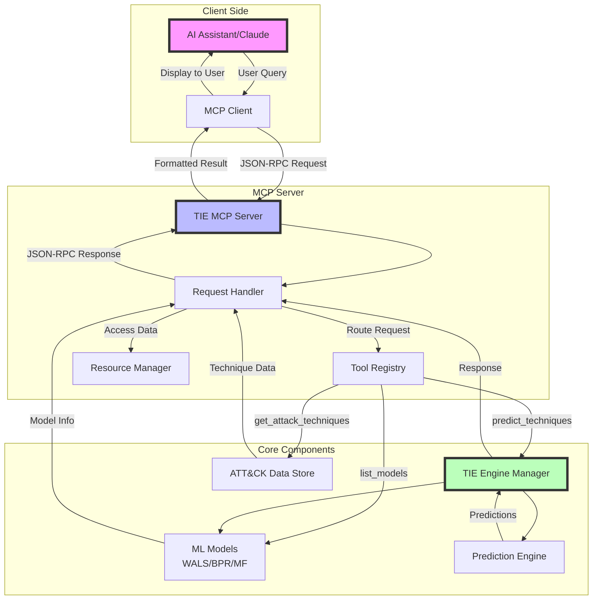
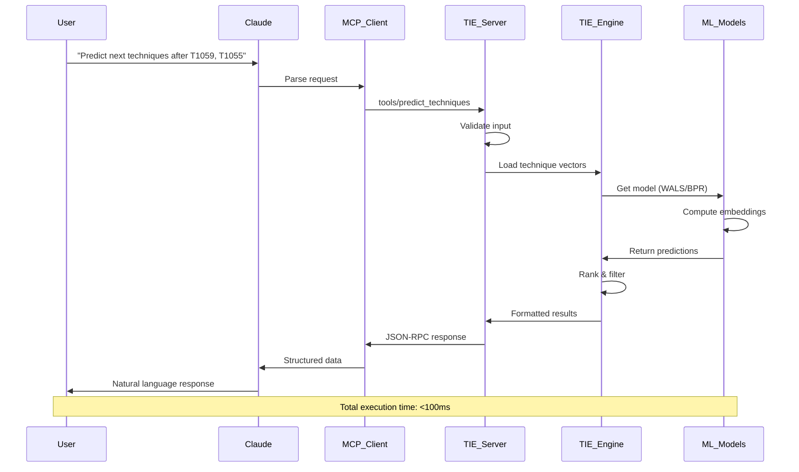
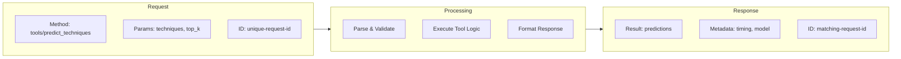
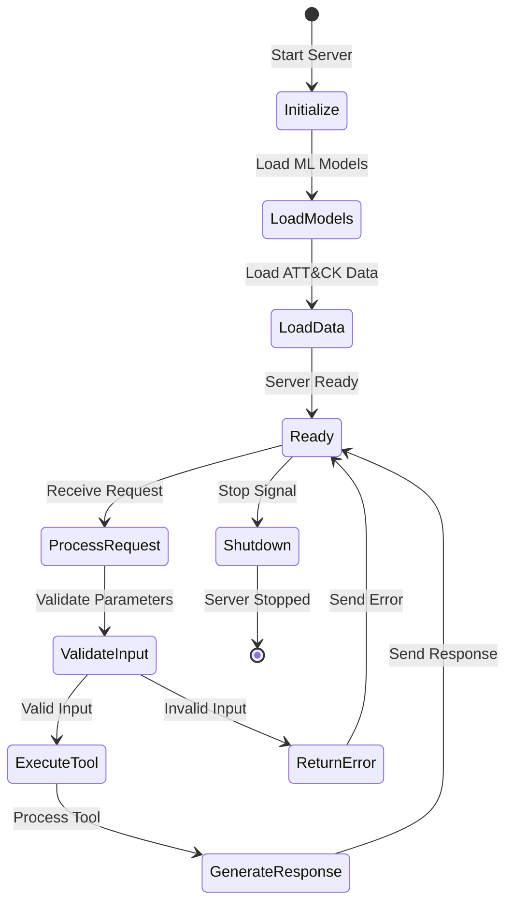

# TIE MCP Server

## GitHub Actions Setup (Optional)

For enhanced GitHub Pages deployment, you can optionally set up a Personal Access Token (PAT):

### Creating a GitHub PAT
1. Go to GitHub Settings → Developer settings → Personal access tokens → Tokens (classic)
2. Generate a new token with these scopes:
   - `repo` (Full control of private repositories)
   - `workflow` (Update GitHub Action workflows)
3. Copy the generated token

### Adding PAT to Repository
1. Go to your repository Settings → Secrets and variables → Actions
2. Click "New repository secret"
3. Name: `GH_TOKEN`
4. Value: Paste your PAT
5. Click "Add secret"

The workflow will automatically use `GH_TOKEN` if available, otherwise fall back to the default `GITHUB_TOKEN`.

---

[](https://www.python.org/downloads/)
[](https://github.com/psf/black)

A comprehensive **Model Context Protocol (MCP)** server implementation for the **Technique Inference Engine (TIE)** project, enabling intelligent MITRE ATT&CK technique prediction through advanced machine learning models.

## 🎯 Overview

The TIE MCP Server provides cybersecurity professionals and researchers with AI-powered predictions of likely MITRE ATT&CK techniques based on observed attack behaviors. Built on the Model Context Protocol, it seamlessly integrates with AI assistants and security tools to enhance threat analysis and incident response capabilities.

## 🔄 How MCP Works - Architecture & Flow

The Model Context Protocol (MCP) enables seamless communication between AI assistants (like Claude) and specialized tools through a standardized protocol. Here's how the TIE MCP Server operates:

### MCP Communication Flow



### Tool Execution Sequence



### MCP Protocol Components

#### 1. **Transport Layer**
- **STDIO Communication**: Secure inter-process communication via standard input/output
- **JSON-RPC 2.0**: Structured request/response protocol
- **Async Processing**: Non-blocking I/O for concurrent requests

#### 2. **Tool System**
The MCP server exposes specialized tools that can be invoked by the AI assistant:

| Tool | Purpose | Input | Output |
|------|---------|-------|--------|
| `predict_techniques` | Predict likely next ATT&CK techniques | Technique IDs, model parameters | Ranked predictions with scores |
| `get_attack_techniques` | Retrieve ATT&CK technique information | Search terms, filters | Technique details |
| `list_models` | List available ML models | Include metrics flag | Model inventory with performance |

#### 3. **Resource System**
Resources provide direct access to server data:

```
tie://models          → Access trained model information
tie://datasets        → View available training datasets
tie://attack/techniques → MITRE ATT&CK framework data
tie://metrics/system  → Real-time performance metrics
```

### MCP Request/Response Flow



### Key Features of MCP Implementation

1. **Stateless Design**: Each request is independent, ensuring reliability
2. **Schema Validation**: All inputs/outputs validated against defined schemas
3. **Error Handling**: Graceful degradation with detailed error messages
4. **Performance Monitoring**: Built-in metrics for latency and throughput
5. **Security First**: Input sanitization, rate limiting, and access control

### Key Features

- **🔮 Intelligent Technique Prediction**: Advanced ML models predict likely next techniques in attack chains
- **🧠 Multiple Algorithm Support**: WALS, BPR, Matrix Factorization, and more
- **📊 Real-time Inference**: Sub-second prediction latency for operational use
- **🔄 Model Retraining**: Dynamic retraining with new CTI data
- **🛡️ Security-First Design**: Local execution with no data exposure
- **🔌 MCP Integration**: Seamless integration with Claude and other AI assistants

## 📋 Prerequisites

Before installation, ensure you have:

- **Python 3.10 or higher** ([Download Python](https://www.python.org/downloads/))
- **Git** for repository management
- **8GB+ RAM** recommended for model operations
- **Basic understanding** of MITRE ATT&CK framework

### System Requirements

| Component | Minimum | Recommended |
|-----------|---------|-------------|
| Python | 3.10+ | 3.11+ |
| RAM | 4GB | 8GB+ |
| Storage | 2GB | 5GB+ |
| OS | Windows 10+, macOS 10.15+, Ubuntu 20.04+ | Latest versions |

## 🚀 Installation

### Method 1: Direct Installation from GitHub

```bash
# Clone the repository
git clone https://github.com/Nidhi2302/TIE-mcp-server.git
cd TIE-mcp-server

# Create and activate virtual environment
python -m venv venv

# On Windows
venv\Scripts\activate

# On macOS/Linux
source venv/bin/activate

# Install the package
pip install -e .
```

### Method 2: Using Poetry (Recommended for Development)

```bash
# Clone the repository
git clone https://github.com/Nidhi2302/TIE-mcp-server.git
cd TIE-mcp-server

# Install Poetry if not already installed
pip install poetry

# Install dependencies
poetry install

# Activate the virtual environment
poetry shell
```

### Method 3: Docker Installation

```bash
# Clone the repository
git clone https://github.com/Nidhi2302/TIE-mcp-server.git
cd TIE-mcp-server

# Build and run with Docker Compose
docker-compose up -d
```

## ⚙️ Configuration

### MCP Client Configuration

Configure your MCP client (e.g., Claude Desktop) by adding the server to your configuration file:

**Claude Desktop Configuration:**

1. **Locate your config file:**
   - **Windows**: `%APPDATA%\Claude\claude_desktop_config.json`
   - **macOS**: `~/Library/Application Support/Claude/claude_desktop_config.json`
   - **Linux**: `~/.config/Claude/claude_desktop_config.json`

2. **Add the TIE MCP Server:**

```json
{
  "mcpServers": {
    "tie-mcp-server": {
      "command": "python",
      "args": ["-m", "tie_mcp.server"],
      "cwd": "/path/to/your/tie-mcp-server"
    }
  }
}
```

3. **Copy example configurations:**

```bash
# Copy and customize configuration examples
cp claude_desktop_config.example.json claude_desktop_config.json
cp mcp_config.example.json mcp_config.json
```

### Environment Configuration

Create a `.env` file for custom configuration:

```bash
# Basic Configuration
ENVIRONMENT=development
LOG_LEVEL=INFO
DEBUG=true

# Data Paths (optional - defaults provided)
ENTERPRISE_ATTACK_FILEPATH=data/datasets/stix/enterprise-attack.json
DEFAULT_DATASET_FILEPATH=data/datasets/combined_dataset_full_frequency.json

# Model Settings
MODEL_DEFAULT_MODEL_TYPE=wals
MODEL_DEFAULT_EMBEDDING_DIMENSION=4
MODEL_VALIDATION_RATIO=0.1
MODEL_TEST_RATIO=0.2
```

## 📖 Usage Examples

### Basic Technique Prediction

Ask Claude (or your MCP client):

```
Can you predict what ATT&CK techniques might be used next if an attacker has already used:
- T1059 (Command and Scripting Interpreter)
- T1055 (Process Injection)
```

**Expected Response Format:**
```json
{
  "predicted_techniques": [
    {
      "technique_id": "T1105",
      "technique_name": "Ingress Tool Transfer",
      "score": 0.85,
      "in_training_data": true
    },
    {
      "technique_id": "T1053",
      "technique_name": "Scheduled Task/Job",
      "score": 0.72,
      "in_training_data": true
    }
  ],
  "input_techniques": ["T1059", "T1055"],
  "model_id": "default",
  "prediction_method": "dot",
  "execution_time_seconds": 0.1
}
```

### Advanced Usage with Custom Parameters

```
Predict the top 10 techniques using cosine similarity for techniques T1566.001 and T1204.002
```

### Getting ATT&CK Technique Information

```
What techniques are related to "command execution" in the MITRE ATT&CK framework?
```

### Model Management

```
List all available trained models with their performance metrics
```

## 🏗️ MCP Integration Details

### How Tools Are Executed

When you interact with the TIE MCP Server through an AI assistant, here's what happens behind the scenes:

1. **Request Parsing**: Your natural language query is interpreted by the AI assistant
2. **Tool Selection**: The assistant identifies which MCP tool to use
3. **Parameter Extraction**: Required parameters are extracted from your query
4. **MCP Protocol**: A JSON-RPC request is sent to the TIE server
5. **Tool Execution**: The server executes the requested tool with provided parameters
6. **Response Processing**: Results are returned via JSON-RPC
7. **Natural Language**: The AI assistant formats the response in a user-friendly way

### Example Tool Execution Flow

```mermaid
graph TD
    A[User: "What techniques follow T1059?"]
    B[Claude: Interprets query]
    C[MCP: predict_techniques tool]
    D[TIE: Load model WALS]
    E[TIE: Compute predictions]
    F[MCP: Return JSON response]
    G[Claude: Format as text]
    H[User: Sees predictions]
    
    A --> B
    B --> C
    C --> D
    D --> E
    E --> F
    F --> G
    G --> H
    
    style A fill:#e1f5fe
    style H fill:#e1f5fe
    style C fill:#fff3e0
    style D fill:#f3e5f5
    style E fill:#f3e5f5
```

## 🛠️ API Documentation

### Available MCP Tools

#### `predict_techniques`
Predict MITRE ATT&CK techniques based on observed techniques.

**Parameters:**
- `techniques` (required): Array of technique IDs (e.g., ["T1059", "T1055"])
- `model_id` (optional): Specific model to use for prediction
- `top_k` (optional, default: 20): Number of predictions to return (1-100)
- `prediction_method` (optional, default: "dot"): Method to use ("dot" or "cosine")

#### `get_attack_techniques`
Get information about MITRE ATT&CK techniques.

**Parameters:**
- `technique_ids` (optional): Array of specific technique IDs to retrieve
- `search_term` (optional): Search term to filter techniques
- `tactic` (optional): Filter by specific tactic

#### `list_models`
List all available trained models.

**Parameters:**
- `include_metrics` (optional, default: true): Include performance metrics

### MCP Communication Protocol

The TIE MCP Server implements the standard MCP protocol with the following message types:

#### Request Message Structure
```json
{
  "jsonrpc": "2.0",
  "method": "tools/predict_techniques",
  "params": {
    "techniques": ["T1059", "T1055"],
    "top_k": 10,
    "model_id": "default"
  },
  "id": "req-001"
}
```

#### Response Message Structure
```json
{
  "jsonrpc": "2.0",
  "result": {
    "predicted_techniques": [...],
    "model_used": "wals_v1",
    "execution_time": 0.087
  },
  "id": "req-001"
}
```

#### Error Response Structure
```json
{
  "jsonrpc": "2.0",
  "error": {
    "code": -32602,
    "message": "Invalid params",
    "data": {
      "details": "technique_id T9999 not found"
    }
  },
  "id": "req-001"
}
```

### Available MCP Resources

- `models://` - Access to trained models information
- `datasets://` - Access to available datasets
- `attack://techniques` - MITRE ATT&CK techniques data
- `metrics://system` - System performance metrics

## 🔧 Development Setup

### Local Development Environment

```bash
# Clone and setup
git clone https://github.com/your-username/tie-mcp-server.git
cd TIE-mcp-server

# Install in development mode
pip install -e ".[dev]"

# Setup pre-commit hooks
pre-commit install

# Run tests
pytest

# Run with coverage
pytest --cov=tie_mcp --cov-report=html

# Format code
black src/ tests/
ruff check src/ tests/ --fix

# Type checking
mypy src/
```

### MCP Server Lifecycle



### Project Structure

```
tie-mcp-server/
├── src/tie_mcp/           # Main application code
│   ├── server.py          # MCP server implementation
│   ├── core/             # Core TIE functionality
│   │   ├── engine_manager.py    # High-level engine interface
│   │   └── tie/          # TIE algorithm implementations
│   ├── config/           # Configuration management
│   ├── models/           # Model management
│   ├── storage/          # Data storage interfaces
│   └── utils/            # Utility functions
├── tests/                # Test suite
│   ├── unit/             # Unit tests
│   └── performance/      # Performance tests
├── data/                 # Data files (gitignored)
├── docker/               # Docker configuration
├── examples/             # Example notebooks
└── .github/              # GitHub workflows
```

## 🔍 Troubleshooting

### Common Issues

#### 1. Import Errors
```bash
# Error: ModuleNotFoundError: No module named 'tie_mcp'
# Solution: Install in editable mode
pip install -e .
```

#### 2. Permission Errors
```bash
# Error: PermissionError when starting server
# Solution: Check file permissions and virtual environment
chmod +x venv/bin/python  # On Unix systems
```

#### 3. Memory Issues
```bash
# Error: Out of memory during model operations
# Solution: Increase system RAM or reduce model parameters
export OMP_NUM_THREADS=1  # Limit OpenMP threads
```

#### 4. MCP Connection Issues
```bash
# Error: Server not responding
# Solutions:
# 1. Check server logs
python -m tie_mcp.server --debug

# 2. Verify configuration paths
# 3. Test server standalone
python -c "from tie_mcp.server import TIEServer; print('OK')"
```

#### 5. Model Loading Errors
```bash
# Error: Model files not found
# Solution: Check data paths in configuration
ls -la data/datasets/
```

### Debug Mode

Enable detailed logging:

```bash
# Set environment variable
export LOG_LEVEL=DEBUG

# Or run with debug flag
python -m tie_mcp.server --debug
```

### Performance Optimization

For better performance:

```bash
# Set thread limits
export OMP_NUM_THREADS=4
export MKL_NUM_THREADS=4

# Use system BLAS
pip install numpy[blas]
```

### Getting Help

- **GitHub Issues**: [Report bugs or request features](https://github.com/your-username/tie-mcp-server/issues)
- **Documentation**: Check inline code documentation
- **Logs**: Review server logs for detailed error information

## 🤝 Contributing

We welcome contributions! Please see our [Contributing Guide](CONTRIBUTING.md) for details.

### Quick Start for Contributors

1. Fork the repository
2. Create a feature branch: `git checkout -b feature/amazing-feature`
3. Make your changes and add tests
4. Run the test suite: `pytest`
5. Commit your changes: `git commit -m 'Add amazing feature'`
6. Push to your fork: `git push origin feature/amazing-feature`
7. Submit a Pull Request

### Code Quality Standards

- **Testing**: Maintain >80% test coverage
- **Type Hints**: All functions must have type annotations
- **Documentation**: Add docstrings for public functions
- **Formatting**: Use Black and Ruff for code formatting
- **Commits**: Follow [Conventional Commits](https://www.conventionalcommits.org/)

## 🔒 Security

### Security Best Practices

- **Local Execution Only**: No network exposure by default
- **STDIO Communication**: Secure inter-process communication
- **No Data Persistence**: Stateless operation model
- **Input Validation**: All inputs are validated and sanitized

### Reporting Security Issues

Please report security vulnerabilities privately by emailing [security@example.com](mailto:security@example.com).

## 📊 Performance

### Benchmark Results

| Operation | Latency (P95) | Throughput |
|-----------|---------------|------------|
| First Prediction | < 5 seconds | N/A |
| Subsequent Predictions | < 100ms | 100+ req/sec |
| Model Loading | < 10 seconds | N/A |
| Memory Usage | ~500MB | Typical |

### Optimization Tips

- **First Run**: Initial model loading may take longer
- **Memory**: Keep models in memory for best performance  
- **Concurrency**: Server handles multiple concurrent requests
- **Caching**: ATT&CK technique information is cached

## 📜 License

This project is licensed under the Apache License 2.0 - see the [LICENSE](LICENSE) file for details.

### Third-Party Licenses

- **MITRE ATT&CK**: Used under [MITRE License](https://github.com/mitre/cti/blob/master/LICENSE.txt)
- **Model Context Protocol**: MIT License
- **Python Dependencies**: Various open source licenses (see requirements)

## 🙏 Acknowledgments

- **MITRE Corporation** for the original TIE project and ATT&CK framework
- **Center for Threat-Informed Defense** for threat intelligence research
- **Model Context Protocol Team** for the MCP specification
- **Open Source Community** for the amazing Python ML ecosystem

## 📈 Changelog

See [CHANGELOG.md](CHANGELOG.md) for a detailed history of changes and releases.

## 🔗 Related Projects

- [MITRE TIE](https://ctid.mitre.org/projects/technique-inference-engine/): Original Technique Inference Engine
- [MCP Specification](https://modelcontextprotocol.io/): Model Context Protocol documentation
- [MITRE ATT&CK](https://attack.mitre.org/): MITRE ATT&CK framework

---

**Made with ❤️ for the cybersecurity community**

For questions, issues, or contributions, please visit our [GitHub repository](https://github.com/your-username/tie-mcp-server).
